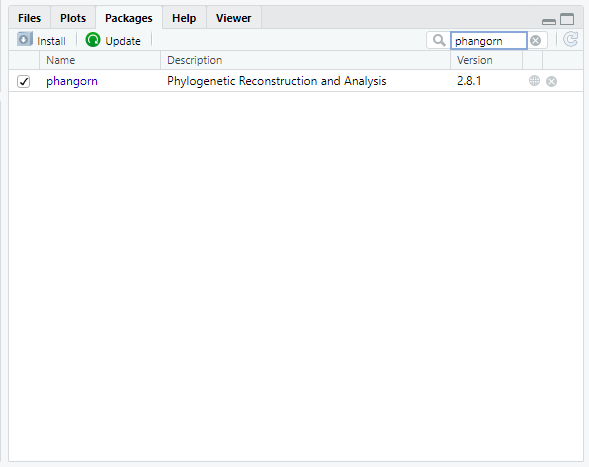

```{r, include = FALSE}
ottrpal::set_knitr_image_path()
```

# Student Activity Guide

This chapter contains the student instructions for the SARS-CoV-2 Phylogeny with RStudio activity.

## Introduction

Since the beginning of the Covid-19 pandemic in December 2019, the world has experienced waves of increased cases caused by new variants. This activity walks you through a simple phylogeny to explore how the new variants are related.

### Before You Start

Make sure you have an AnVIL account (refer to https://jhudatascience.org/AnVIL_Book_Instructor_Guide/student-account-setup.html) 

### Objectives


This activity will teach you how to use the AnVIL platform to:

1. Get started working on AnVIL
1. Launch RStudio
1. Import data into RStudio
1. Examine fasta and phyDat files
1. Build a neighbor-joining phylogeny
1. Interpret the topology and branch lengths of a phylogeny

## Getting Started

In the next few steps, you will walk through how to get set up to use RStudio on the AnVIL platform. AnVIL is centered around different “Workspaces”. Each Workspace functions almost like a mini code laboratory - it is a place where data can be examined, stored, and analyzed. The first thing we want to do is to copy or “clone” a Workspace to create a space for you to experiment.

Use a web browser to go to the AnVIL website. In the browser type:

```
anvil.terra.bio
```

:::{.notice}
**Tip**
At this point, it might make things easier to open up a new window in your browser and split your screen. That way, you can follow along with this guide on one side and execute the steps on the other.
:::

### Set Up

## Exercise One: Loading libraries in RStudio

Before we can start our analysis of how the SARS-CoV-2 variants are related to each other, we need to prepare the RStudio workspace and load the data. 

R is an open-source statistical programming language and anyone can contribute to it. People have written programs in R to do a ton of different things, and they can make those programs (known as packages, or libraries) available to everyone. Generally, when someone has created a package they want to share, they will submit it to a repository, where anyone using R can download it. 

For this lesson, we are using the [CRAN](https://cran.r-project.org/) (Comprehensive R Archive Network) repository. There are a series of servers around the world that store the up-to-date packages. When you open R, you can access those servers and download any package you want. If we are downloading a package that has been stored on CRAN, we use the command `install.packages`.

We need to install two packages:
[ape](https://academic.oup.com/bioinformatics/article/20/2/289/204981) and [phangorn](https://academic.oup.com/bioinformatics/article/27/4/592/198887). Both of these packages were written specifically for phylogenetic analysis in R.

To install the packages, we type the following code into the RStudio console:

```{r, message = FALSE, warning = FALSE}
install.packages('ape')

install.packages('phangorn')
```

Once you've downloaded a package, it will be saved on your computer (or, in the case of AnVIL, on your persistent disk space) so that you don't have to download it again. Anytime you want to use the set of commands that are stored in a particular package, you'll tell R to open the package with the `library` command. 

Let's open both packages now:

```{r, message = FALSE, warning = FALSE}
library(ape)
library(phangorn)
```

You can verify that both packages have been loaded by looking at the Packages tab in the lower left-hand window of the RStudio interface. Packages that have been loaded are checked. You can search specifically for each package, or scroll down the entire list.




## Exercise Two: Examining fasta files in RStudio

Now we need to retrieve the data. We'll start by loading a type of data file called a fasta file. The fasta format is a common way to store sequences (either DNA or protein). Each sample in a fasta file has two sections. The sample ID and other descriptive information is on the first line (the description line). This line begins with either a > or a ;. The sample sequence is on the line immediately after the description. The sequence is written in standard IUCAC codes for either nucleic acids (for DNA sequence) or amino acids (for protein sequence). The sequence can also include unknown bases or gaps.

The fasta file we're loading first contains the aligned sequences for the spike protein of 5 SARS-CoV-2 samples. This is what the top of the file looks like in a text editor:


We can load this file into RStudio using the `read.FASTA` command and save it as the object "spike.small".

```{r, message = FALSE, warning = FALSE}
spike.fasta <- read.FASTA("sars_spike_protein.fasta")
```

After we've created an object in RStudio, we can get information about the object by typing the object's name.

```{r, message = FALSE, warning = FALSE}
spike.fasta
```

Here we can see a summary of what this object contains, as well as how long the sequences are and the sequence names. 

Notice that RStudio has saved the information in the fasta file as binary data. This means the sequence information has been converted from "ATCG" into something easier for RStudio to work with, but harder for humans to interpret.

The `phangorn` package uses a special data format called `phyDat`, which is derived from the fasta format. A `phyDat` object provides some additional information about the samples we upload. 

```{r, message = FALSE, warning = FALSE}
spike.phydat <- read.phyDat("sars_spike_protein.fasta", format = "fasta")

spike.phydat
```

Different site patterns refers to sites that differ between sequences. In this small dataset, 46 of the 3827 possible bases (characters) show differences among these SARS-CoV-2 samples.

We've been working with a dataset that contains the original SARS-CoV-2 sequence (the Wuhan reference sample), as well as samples of the alpha, beta, delta, and gamma variants. Another variant, the omicron variant, was first identified in late 2021 and quickly became a variant of concern. Let's look at a dataset that contains additional omicron samples.

```{r, message = FALSE, warning = FALSE}
spike.omicron <- read.phyDat("sars_spike_protein_omicron.fasta", format = "fasta")

spike.omicron
```

::: {.reflection}
QUESTIONS:

1. What is some information saved in a .fasta object that RStudio tells us that we don't get from a .phyDat object?

2. How many omicron sequences are there in the second file (loaded into the object `spike.omicron`)?

3. Do you think there is more variability in the omicron sequences than in other variants (alpha, beta, delta, and gamma)? Why or why not?
:::

## Exercise Three: How are variants related to the original SARS-CoV-2 reference strain?

We'll work with both the smaller spike protein dataset (saved as  `spike.small`) and the spike protein dataset with omicron samples (saved as `spike.omicron`) in this activity. 

### Building a neighbor-joining tree

We can use `phyDat` objects to build a type of phylogenetic tree called a neighbor-joining tree. We can do this in two steps in RStudio using the `phangorn` package.

```{r, message = FALSE, warning = FALSE}
dist.small <- dist.ml(spike.phydat)
nj.small <- nj(dist.small)
```

The first command (`dist.ml`) converts the genetic data into a distance matrix, while the second command (`nj`) uses the matrix to group taxa based on the genetic distance between them. We plot the object created by the `nj` command to visualize our phylogenetic tree.

```{r, message = FALSE, warning = FALSE}
plot(nj.small)
```

We can do the same for the larger dataset that includes omicron sequences.

```{r, message = FALSE, warning = FALSE}
dist.omicron <- dist.ml(spike.omicron)
nj.omicron <- nj(dist.omicron)
plot(nj.omicron)
```

When reading phylogenetic trees, it's important to remember that relatedness is determined by the number of nodes between two taxa. The delta variant is most closely related to the beta variant because they share a common node (where the branches join together). We always look at common ancestors of clades, so we essentially read ancestry on a tree from right (where the taxa are) to left. Thus, the delta variant is more closely related to the beta variant because the delta branch connects to a node shared by the beta branch before it connects to a node shared with the gamma branch or the Wuhan reference/alpha variant branch.

::: {.reflection}
QUESTIONS:

4. which variant is most closely related to the original Wuhan reference sequence?

5. Which variant(s) is the most distantly related to the original Wuhan reference sequence?

6. Which variant shares the most recent common ancestor with the omicron variants? What does this mean for determining where the omicron variant came from?
:::

### Examining branch lengths

Now we will add branch lengths to our trees. Information about branch lengths are saved in our previous trees, but those branch lengths are equal to the number of substitutions per site, which can be difficult to interpret. Instead, we will look at trees where the branch lengths have been scaled so that each branch is equal to the total number of substitutions (changes in the DNA sequence).

First, let's load and view a tree containing the five non-omicron sequences.

```{r, message = FALSE, warning = FALSE}
spike.tree_small <- read.tree("sars_tree_small.tre")

plot(spike.tree_small)
edgelabels(spike.tree_small$edge.length)
```

The numbers in green boxes represent the number of DNA changes along a particular branch. For example, the Wuhan reference sequence is estimated to have only one DNA change from the spike protein sequence of the most recent common ancestor of all SARS-CoV-2 strains, while the alpha variant has 6 bases different from the most recent common ancestor. This also means the distance between Wuhan reference sequence and the alpha sample is 7 substitutions (1 substitution for the Wuhan sample + 6 substitutions for the alpha variant sample).

::: {.dictionary}
**Breakout Box: Learn more about phylogenetically informative sites**

You may be wondering why the total branch length changes (31) is different from the number of site patterns listed in the phyDat summary (46). This is because only some of the 46 site patterns are what we call _phylogenetically informative_.

Let's look at a short example:

cat     GC*A* TT*C*

dog     GC*C* TT*C*

frog    GC*C* TT*A*

snake   GC*C* TT*A*

In this collection of sequences, there are 2 site patterns (both in bold), but only one is phylogenetically informative because it tells us about the relatedness between the species. While the cat sequence is different from the others at the third site, this doesn't actually give us information about the relationships among the four species. The sixth site, however, tells us that the cat and dog share a mutation that frog and snake do not. We can interpret that to mean the cat and dog are more closely related to each other than either is to the frog or the snake. Thus, this particular site pattern gives us information we can use to build the phylogenetic tree.
:::

::: {.reflection}
QUESTIONS:

7. what is the branch length distance between the beta variant and the alpha variant?

8. Is the delta or the beta variant more closely related to the Wuhan reference sequence? How do you know?

9. What is the longest branch length in the tree? What does this mean for the amount of variability seen in that variants versus the others?
:::

Now let's load and view a tree containing all nine SARS-CoV-2 samples.

```{r, message = FALSE, warning = FALSE}
spike.tree_full <- read.tree("sars_tree_full.tre")

plot(spike.tree_full)
edgelabels(spike.tree_full$edge.length)
```

What do these branch lengths tell us about the relationship among the SARS-CoV-2 variants?

::: {.reflection}
QUESTIONS:

10. Did adding the omicron samples change the branch length distances between the original five samples? What is the branch length distance between the delta and beta variants now?

11. What is the branch length distance between the omicron clade and its closest relative?

12. The covid vaccines were originally designed based on the Wuhan reference sequence of the spike protein. Using what you have learned about the phylogenetic tree of SARS-CoV-2 variants, can you explain why these initial vaccines were less effective at protecting against the omicron variants than they were against the delta variant?
:::

## Exercise Four: Do other protein-coding regions show us the same phylogenetic relationships?

The SARS-CoV-2 genome contains 6 protein-coding regions. So far, we've been working with genetic data from the region that codes for spike protein. (The spike protein is the part of the virus that sticks out to form the characteristic spikes on the outside of the SARS-CoV-2 virus.) However, you could also use any of the other 5 protein-coding regions for this exercise. 

Let's look at sequences from the region that codes for the membrane glycoprotein.

```{r, message = FALSE, warning = FALSE}
membrane.omicron <- read.phyDat("sars_membrane_protein_omicron.fasta", format = "fasta")

membrane.omicron
```

::: {.reflection}
QUESTIONS:

13. Based on the information from the phydat files for the spike protein dataset and the membrane protein dataset, is there the same amount of variation in each protein-coding region?

14. Do you think the spike protein dataset or the membrane protein dataset contains a greater number of phylogenetically-informative sites? 
:::

Now let's look at a neighbor-joining tree built using the membrane protein dataset.

```{r, message = FALSE, warning = FALSE}
nj.membrane <- read.tree("sars_membrane_tree.tre")

plot(nj.membrane)
edgelabels(nj.membrane$edge.length)

```

::: {.reflection}
QUESTIONS:

15. Is the tree built from the membrane protein data the same as the tree built from the spike protein data?

16. Why is a greater number of phylogenetically-informative sites better for tree building?
:::


## Wrap-up

Once you are done with the activity, you’ll need to shut down your RStudio cloud environment. This frees up the cloud resources for others and minimizes computing cost. The following steps will delete your work, so make sure you are completely finished at this point. Otherwise, you will have to repeat your work from the previous steps.

