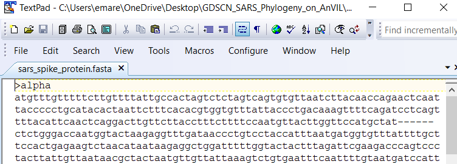
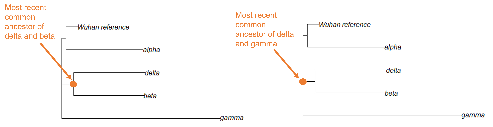

# (PART\*) Lab Exercise Materials {-}


# Student Activity Guide

This chapter contains the student instructions for the SARS-CoV-2 Phylogeny with RStudio activity.

## Introduction

Since the beginning of the Covid-19 pandemic in December 2019, the world has experienced waves of increased cases caused by new variants. This activity walks you through a simple phylogeny to explore how the new variants are related. If you are interested in learning more about this topic, we recommend you check out the SARS-CoV-2 resources on [Nextstrain.org](https://nextstrain.org/sars-cov-2/).

### Before You Start


If you do not already have a Google account that you would like to use for accessing Terra, [create one now](https://accounts.google.com/SignUp).

If you would like to create a Google account that is associated with your non-Gmail, institutional email address, follow [these instructions](https://support.terra.bio/hc/en-us/articles/360029186611).

### Objectives

This activity will teach you how to use the AnVIL platform to:

1. Get started working on AnVIL
1. Launch RStudio
1. Import data into RStudio
1. Examine fasta and phyDat files
1. Build a neighbor-joining phylogeny
1. Interpret the topology and branch lengths of a phylogeny

## Getting Started

In the next few steps, you will walk through how to get set up to use RStudio on the AnVIL platform. AnVIL is centered around different “Workspaces”. Each Workspace functions almost like a mini code laboratory - it is a place where data can be examined, stored, and analyzed. The first thing we want to do is to copy or “clone” a Workspace to create a space for you to experiment.

Use a web browser to go to the AnVIL website. In the browser type:

```
anvil.terra.bio
```

:::{.notice}
**Tip**
At this point, it might make things easier to open up a new window in your browser and split your screen. That way, you can follow along with this guide on one side and execute the steps on the other.
:::

A workspace for this activity on AnVIL coming soon!

### Set Up

### Video overview of RStudio on AnVIL


Here is a video tutorial that describes the basics of using RStudio on AnVIL.

<iframe src="https://drive.google.com/file/d/1v72ZG8JIRDUaewFQgGfcCO_qoM4eYmYX/preview" width="640" height="360" allow="autoplay"></iframe>

### Objectives

- Start compute for your RStudio environment
- Tour RStudio on AnVIL
- Stop compute to minimize expenses

### Slides

The slides for this tutorial are are located [here](https://docs.google.com/presentation/d/1eypYLLqD11-NwHLs4adGpcuSB07dYEJfAaALSMvgzqw).

#### Launching RStudio


```
## Warning: Chunk option fig.alt is not supported for docx output

## Warning: Chunk option fig.alt is not supported for docx output

## Warning: Chunk option fig.alt is not supported for docx output

## Warning: Chunk option fig.alt is not supported for docx output

## Warning: Chunk option fig.alt is not supported for docx output

## Warning: Chunk option fig.alt is not supported for docx output

## Warning: Chunk option fig.alt is not supported for docx output

## Warning: Chunk option fig.alt is not supported for docx output

## Warning: Chunk option fig.alt is not supported for docx output

## Warning: Chunk option fig.alt is not supported for docx output
```


:::{.warning}
AnVIL is very versatile and can scale up to use very powerful cloud computers. It's very important that you select a cloud computing environment appropriate to your needs to avoid runaway costs.  If you are uncertain, start with the default settings; it is fairly easy to increase your compute resources later, if needed, but harder to scale down.
:::

Note that, in order to use RStudio, you must have access to a Terra Workspace with permission to compute (i.e. you must be a "Writer" or "Owner" of the Workspace).

1. Open Terra - use a web browser to go to [`anvil.terra.bio`](https://anvil.terra.bio/)

1. In the drop-down menu on the left, navigate to "Workspaces". Click the triple bar in the top left corner to access the menu. Click "Workspaces".

    {width=100%}

1. Click on the name of your Workspace. You should be routed to a link that looks like: `https://anvil.terra.bio/#workspaces/<billing-project>/<workspace-name>`.

1. Click on the cloud icon on the far right to access your Cloud Environment options.

    {width=100%}

1. In the dialogue box, click the "Settings" button under RStudio

    {width=100%}

1. You will see some details about the default RStudio cloud environment, and a list of costs because it costs a small amount of money to use cloud computing.

    {width=100%}


1. If you are uncertain about what you need, the default configuration is a reasonable, cost-conservative choice.  It is fairly easy to increase your compute resources later, if needed, but harder to scale down. Click the “Create” button.

    {width=100%}


1. Otherwise, click “CUSTOMIZE” to modify the environment for your needs.

    {width=100%}

    

    

    

    

    

1. The dialogue box will close and you will be returned to your Workspace.  You can see the status of your cloud environment by hovering over the RStudio logo.  It will take a few minutes for Terra to request computers and install software.

    {width=100%}

1. When your environment is ready, its status will change to “Running”.  Click on the RStudio logo to open a new dialogue box that will let you launch RStudio.

    {width=100%}
    
1. Click the launch icon to open RStudio.  This is also where you can pause, modify, or delete your environment when needed.

    {width=100%}

1. You should now see the RStudio interface with information about the version printed to the console.

    {width=100%}

#### Touring RStudio


```
## Warning: Chunk option fig.alt is not supported for docx output

## Warning: Chunk option fig.alt is not supported for docx output

## Warning: Chunk option fig.alt is not supported for docx output

## Warning: Chunk option fig.alt is not supported for docx output

## Warning: Chunk option fig.alt is not supported for docx output

## Warning: Chunk option fig.alt is not supported for docx output

## Warning: Chunk option fig.alt is not supported for docx output

## Warning: Chunk option fig.alt is not supported for docx output

## Warning: Chunk option fig.alt is not supported for docx output

## Warning: Chunk option fig.alt is not supported for docx output
```


Next, we will be using RStudio and the package `Glimma` to create interactive plots. See [this vignette](https://bioconductor.org/packages/release/bioc/vignettes/Glimma/inst/doc/limma_edger.html) for more information.

1. The Bioconductor team has created a very useful package to programmatically interact with Terra and Google Cloud. Install the `AnVIL` package. It will make some steps easier as we go along.

    

    

1. You can now quickly install precompiled binaries using the AnVIL package’s `install()` function. We will use it to install the `Glimma` package and the `airway` package. The `airway` package contains a `SummarizedExperiment` data class. This data describes an RNA-Seq experiment on four human airway smooth muscle cell lines treated with dexamethasone. 

{Note: for some of the packages, you will have to install packaged from the CRAN repository, using the install.packages() function. The examples will show you which install method to use.}

    

    

1. Load the example data.

    

    

1. The multidimensional scaling (MDS) plot is frequently used to explore differences in samples. When this data is MDS transformed, the first two dimensions explain the greatest variance between samples, and the amount of variance decreases monotonically with increasing dimension. The following code will launch a new window where you can interact with the MDS plot.

    

    

1. Change the `colour_by` setting to "groups" so you can easily distinguish between groups. In this data, the "group" is the treatment.

    

1. You can download the interactive html file by clicking on "Save As".

    

1. You can also download plots and other files created directly in RStudio. To download the following plot, click on "Export" and save in your preferred format to the default directory. This saves the file in your cloud environment.

    

    

1. You should see the plot in the "Files" pane.

    

1. Select this file and click "More" > "Export"

    

1. Select "Download" to save the file to your local machine.

    

#### Pausing RStudio


```
## Warning: Chunk option fig.alt is not supported for docx output

## Warning: Chunk option fig.alt is not supported for docx output
```


1. The upper right corner reminds you that you are accruing cloud computing costs.

    

1. You should minimize charges when you are not performing an analysis. You can do this by clicking on “Stop cloud environment”. This will release the CPU and memory resources for other people to use. Note that your work will be saved in the environment and continue to accrue a very small cost.  This work will be lost if the cloud environment gets deleted.  If there is anything you would like to save permanently, it's a good idea to copy it from your compute environment to another location, such as the Workspace bucket, GitHub, or your local machine, depending on your needs.

    


## Exercise One: Loading libraries in RStudio

Before we can start our analysis of how the SARS-CoV-2 variants are related to each other, we need to prepare the RStudio workspace and load the data. 

R is an open-source statistical programming language and anyone can contribute to it. People have written programs in R to do a ton of different things, and they can make those programs (known as packages, or libraries) available to everyone. Generally, when someone has created a package they want to share, they will submit it to a repository, where anyone using R can download it. 

For this lesson, we are using the [CRAN](https://cran.r-project.org/) (Comprehensive R Archive Network) repository. There are a series of servers around the world that store the up-to-date packages. When you open R, you can access those servers and download any package you want. If we are downloading a package that has been stored on CRAN, we use the command `install.packages`.

We need to install two packages:
[ape](https://academic.oup.com/bioinformatics/article/20/2/289/204981) and [phangorn](https://academic.oup.com/bioinformatics/article/27/4/592/198887). Both of these packages were written specifically for phylogenetic analysis in R.

To install the packages, we type the following code into the RStudio console:


```r
install.packages('ape')

install.packages('phangorn')
```

Once you've downloaded a package, it will be saved on your computer (or, in the case of AnVIL, on your persistent disk space) so that you don't have to download it again. Anytime you want to use the set of commands that are stored in a particular package, you'll tell R to open the package with the `library` command. 

Let's open both packages now:


```r
library(ape)
library(phangorn)
```

You can verify that both packages have been loaded by looking at the Packages tab in the lower left-hand window of the RStudio interface. Packages that have been loaded are checked. You can search specifically for each package, or scroll down the entire list.


## Exercise Two: Examining fasta files in RStudio

Now we need to retrieve the data. We'll start by loading a type of data file called a fasta file. The fasta format is a common way to store sequences (either DNA or protein). Each sample in a fasta file has two sections. The sample ID and other descriptive information is on the first line (the description line). This line begins with either a > or a ;. The sample sequence is on the line immediately after the description. The sequence is written in standard IUCAC codes for either nucleic acids (for DNA sequence) or amino acids (for protein sequence). The sequence can also include unknown bases or gaps.

The fasta file we're loading first contains the aligned sequences for the spike protein of 5 SARS-CoV-2 samples. This is what the top of the file looks like in a text editor:



We can load this file into RStudio using the `read.FASTA` command and save it as the object "spike.fasta".


```r
spike.fasta <- read.FASTA("sars_spike_protein.fasta")
```

After we've created an object in RStudio, we can get information about the object by typing the object's name.


```r
spike.fasta
```

```
## 5 DNA sequences in binary format stored in a list.
## 
## All sequences of same length: 3827 
## 
## Labels:
## alpha
## beta
## delta
## gamma
## Wuhan_reference
## 
## Base composition:
##     a     c     g     t 
## 0.294 0.188 0.184 0.333 
## (Total: 19.14 kb)
```

Here we can see a summary of what this object contains, as well as how long the sequences are and the sequence names. 

Notice that RStudio has saved the information in the fasta file as binary data. This means the sequence information has been converted from "ATCG" into something easier for RStudio to work with, but harder for humans to interpret.

The `phangorn` package uses a special data format called `phyDat`, which is derived from the fasta format. A `phyDat` object provides some additional information about the samples we upload. 


```r
spike.phydat <- read.phyDat("sars_spike_protein.fasta", format = "fasta")

spike.phydat
```

```
## 5 sequences with 3827 character and 46 different site patterns.
## The states are a c g t
```

Different site patterns refers to sites that differ between sequences. In this small dataset, 46 of the 3827 possible bases (characters) show differences among these SARS-CoV-2 samples.

We've been working with a dataset that contains the original SARS-CoV-2 sequence (the Wuhan reference sample), as well as samples of the alpha, beta, delta, and gamma variants. Another variant, the omicron variant, was first identified in late 2021 and quickly became a variant of concern. Let's look at a dataset that contains additional omicron samples.


```r
spike.omicron <- read.phyDat("sars_spike_protein_omicron.fasta", format = "fasta")

spike.omicron
```

```
## 9 sequences with 3827 character and 96 different site patterns.
## The states are a c g t
```

::: {.reflection}
QUESTIONS:

1. What is some information saved in a .fasta object that RStudio tells us that we don't get from a .phyDat object?

2. How many omicron sequences are there in the second file (loaded into the object `spike.omicron`)?

3. Do you think there is more variability in the omicron sequences than in other variants (alpha, beta, delta, and gamma)? Why or why not?
:::

## Exercise Three: How are variants related to the original SARS-CoV-2 reference strain?

We'll work with both the smaller spike protein dataset (saved as  `spike.phydat`) and the spike protein dataset with omicron samples (saved as `spike.omicron`) in this activity. 

### Building a neighbor-joining tree

We can use `phyDat` objects to build a type of phylogenetic tree called a neighbor-joining tree. We can do this in two steps in RStudio using the `phangorn` package.


```r
dist.small <- dist.ml(spike.phydat)
nj.small <- nj(dist.small)
```

The first command (`dist.ml`) converts the genetic data into a distance matrix, while the second command (`nj`) uses the matrix to group taxa based on the genetic distance between them. We plot the object created by the `nj` command to visualize our phylogenetic tree.


```r
plot(nj.small)
```

<!-- -->

When reading phylogenetic trees, it's important to remember that relatedness is determined by the number of nodes between two taxa. The delta variant is most closely related to the beta variant because they share a common node (where the branches join together). We always look at common ancestors of clades, so we essentially read ancestry on a tree from right (where the taxa are) to left. Thus, the delta variant is more closely related to the beta variant because the delta branch connects to a node shared by the beta branch before it connects to a node shared with the gamma branch or the Wuhan reference/alpha variant branch.



Now let's look at where the omicron sequences are in the SARS-CoV-2 tree.


```r
dist.omicron <- dist.ml(spike.omicron)
nj.omicron <- nj(dist.omicron)
plot(nj.omicron)
```

<!-- -->


::: {.reflection}
QUESTIONS:

4. Which variant is most closely related to the original Wuhan reference sequence?

5. Which variant(s) is the most distantly related to the original Wuhan reference sequence?

6. Which variant shares the most recent common ancestor with the omicron variants? What does this mean for determining where the omicron variant came from?
:::

### Examining branch lengths

Now we will add branch lengths to our trees. Information about branch lengths are saved in our previous trees, but those branch lengths are equal to the number of substitutions per site, which can be difficult to interpret. Instead, we will look at trees where the branch lengths have been scaled so that each branch is equal to the total number of substitutions (changes in the DNA sequence).

First, let's load and view a tree containing the five non-omicron sequences.


```r
spike.tree_small <- read.tree("sars_tree_small.tre")

plot(spike.tree_small)
edgelabels(spike.tree_small$edge.length)
```

<!-- -->

The numbers in green boxes represent the number of DNA changes along a particular branch. For example, the Wuhan reference sequence is estimated to have only one DNA change from the spike protein sequence of the most recent common ancestor of all SARS-CoV-2 strains, while the alpha variant has 6 bases different from the most recent common ancestor. This also means the distance between Wuhan reference sequence and the alpha sample is 7 substitutions (1 substitution for the Wuhan sample + 6 substitutions for the alpha variant sample).

::: {.dictionary}
**Breakout Box: Learn more about phylogenetically informative sites**

You may be wondering why the total branch length changes (31) is different from the number of site patterns listed in the phyDat summary (46). This is because only some of the 46 site patterns are what we call _phylogenetically informative_.

Let's look at a short example:

cat:    GC**A** TT**C**

dog:    GC**C** TT**C**

frog:   GC**C** TT**A**

snake:    GC**C** TT**A**

In this collection of sequences, there are 2 site patterns (both in bold), but only one is phylogenetically informative because it tells us about the relatedness between the species. While the cat sequence is different from the others at the third site, this doesn't actually give us information about the relationships among the four species. The sixth site, however, tells us that the cat and dog share a mutation that frog and snake do not. We can interpret that to mean the cat and dog are more closely related to each other than either is to the frog or the snake. Thus, this particular site pattern gives us information we can use to build the phylogenetic tree.
:::

::: {.reflection}
QUESTIONS:

7. what is the branch length distance between the beta variant and the alpha variant?

8. What is the longest branch length in the tree? What does this mean for the number of mutations (compared to the Wuhan reference sequence) seen in that variant versus the others?
:::

Now let's load and view a tree containing all nine SARS-CoV-2 samples.


```r
spike.tree_full <- read.tree("sars_tree_full.tre")

plot(spike.tree_full)
edgelabels(spike.tree_full$edge.length)
```

<!-- -->

What do these branch lengths tell us about the relationship among the SARS-CoV-2 variants?

::: {.reflection}
QUESTIONS:

9. Did adding the omicron samples change the branch length distances between the original five samples? What is the branch length distance between the alpha and beta variants now?

10. What is the length of the branch connecting the omicron group to the rest of the tree

11. The covid vaccines were originally designed based on the Wuhan reference sequence of the spike protein. The immune system learns to recognize the spike protein from the vaccine and can identify and destroy any invading Covid-19 viruses. Using what you have learned about the phylogenetic tree of SARS-CoV-2 variants, can you explain why these initial vaccines were less effective at protecting against the omicron variants than they were against the delta variant?
:::

## Exercise Four: Do other protein-coding regions show us the same phylogenetic relationships?

The SARS-CoV-2 genome contains 6 protein-coding regions. So far, we've been working with genetic data from the region that codes for spike protein. (The spike protein is the part of the virus that sticks out to form the characteristic spikes on the outside of the SARS-CoV-2 virus.) However, you could also use any of the other 5 protein-coding regions for this exercise. 


Let's look at sequences from the region that codes for the membrane glycoprotein.


```r
membrane.omicron <- read.phyDat("sars_membrane_protein_omicron.fasta", format = "fasta")

membrane.omicron
```

```
## 9 sequences with 670 character and 10 different site patterns.
## The states are a c g t
```

::: {.reflection}
QUESTIONS:

12. Based on the information from the phydat files for the spike protein dataset and the membrane protein dataset, is there the same amount of variation in each protein-coding region?

13. Do you think the spike protein dataset or the membrane protein dataset contains a greater number of phylogenetically-informative sites? 
:::

Now let's look at a neighbor-joining tree built using the membrane protein dataset.


```r
nj.membrane <- read.tree("sars_membrane_tree.tre")

plot(nj.membrane)
edgelabels(nj.membrane$edge.length)
```

<!-- -->

::: {.reflection}
QUESTIONS:

14. Is the tree built from the membrane protein data the same as the tree built from the spike protein data?

15. Why is a greater number of phylogenetically-informative sites better for tree building?
:::


## Wrap-up

Once you are done with the activity, you’ll need to shut down your RStudio cloud environment. This frees up the cloud resources for others and minimizes computing cost. The following steps will delete your work, so make sure you are completely finished at this point. Otherwise, you will have to repeat your work from the previous steps.


```
## Warning: Chunk option fig.alt is not supported for docx output

## Warning: Chunk option fig.alt is not supported for docx output

## Warning: Chunk option fig.alt is not supported for docx output

## Warning: Chunk option fig.alt is not supported for docx output
```


1. Stopping your cloud environment only pauses your work. When you are ready to delete the cloud environment, click on the gear icon in the upper right corner to “Update cloud environment”.

    

1. Click on “Delete Environment Options”.

    

1. If you are certain that you do not need the data and configuration on your disk, you should select "Delete everything, including persistent disk".  If there is anything you would like to save, open the compute environment and copy the file(s) from your compute environment to another location, such as the Workspace bucket, GitHub, or your local machine, depending on your needs.

    

1. Select "DELETE".

    
